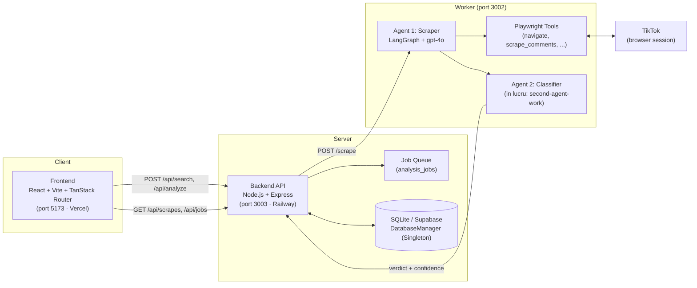

# Arhitectura sistemului

**Agentic Disinformation Detection Pipeline** — detectarea dezinformării în conținut TikTok cu ajutorul agenților AI.

## Diagrama componentelor

## Responsabilitatea fiecărui serviciu

| Serviciu | Tehnologie | Rol |
|----------|-----------|-----|
| **frontend** | React + Vite + TanStack Router | UI: input de query, lista de joburi, verdictul per video |
| **backend** | Express | API REST, coada de joburi, persistența în DB |
| **worker** | Express + Playwright + LangGraph | Rulează agenții AI care navighează TikTok și clasifică conținutul |
| **DB** | better-sqlite3 (local) → Supabase | `scrape_runs`, `analysis_jobs` |

## De ce e worker-ul separat de backend

Runtime-ul de browser (Playwright) e greu și instabil. Separându-l într-un
serviciu propriu, poate fi scalat, restartat și deployat independent, fără să
afecteze API-ul principal.

## Fluxul de date (high level)

1. Utilizatorul trimite un query / URL de TikTok din frontend.
2. Backend pune un job în coadă (`analysis_jobs`) și/sau cheamă worker-ul.
3. **Agent 1 (scraper)** găsește videoclipuri și extrage comentarii + URL-ul MP4.
4. **Agent 2 (classifier)** analizează conținutul și emite un verdict
   (dezinformare / autentic) cu un scor de încredere.
5. Rezultatul e persistat și afișat în frontend.
