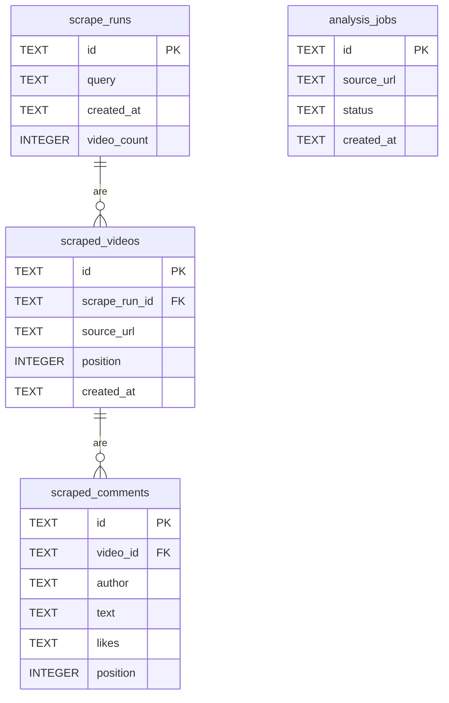
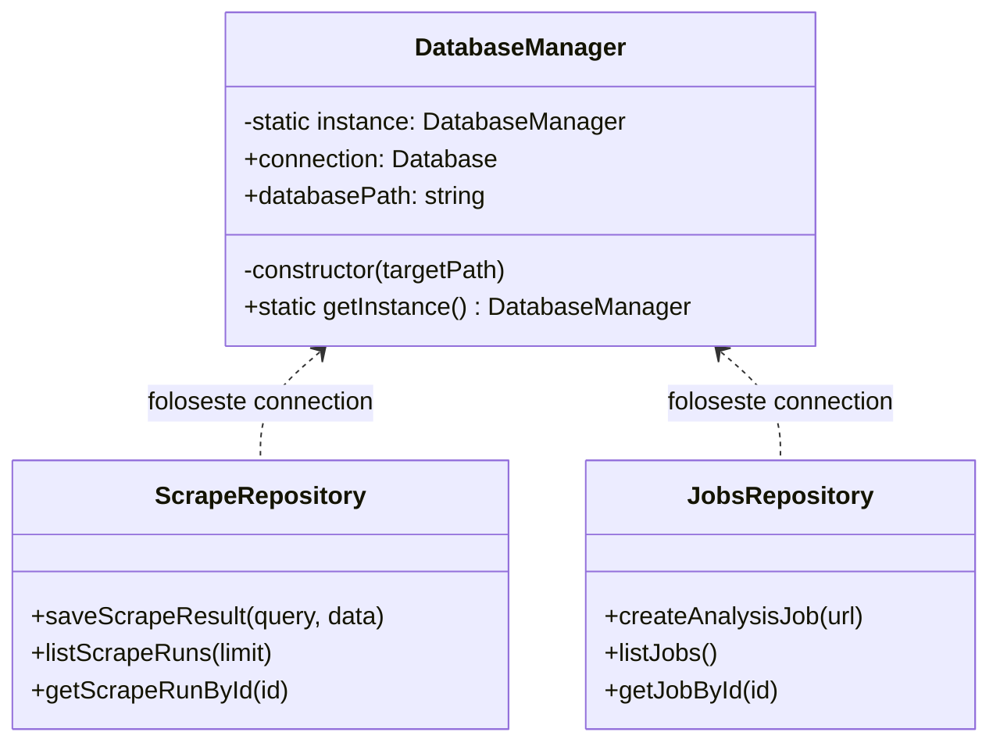

# Modelul de date

Persistența folosește `better-sqlite3` în dev (fișier local) și se mută pe
**Supabase** în producție. Schema e definită în `backend/src/db/schema.ts`.

## Diagrama ER

`scraped_videos` și `scraped_comments` au `ON DELETE CASCADE` — ștergerea unui
run șterge automat videoclipurile și comentariile asociate.

## Diagrama de clase (acces la date)

