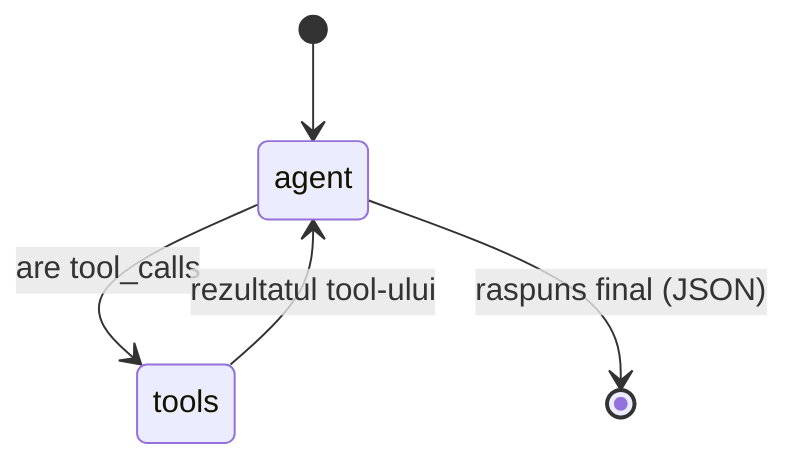
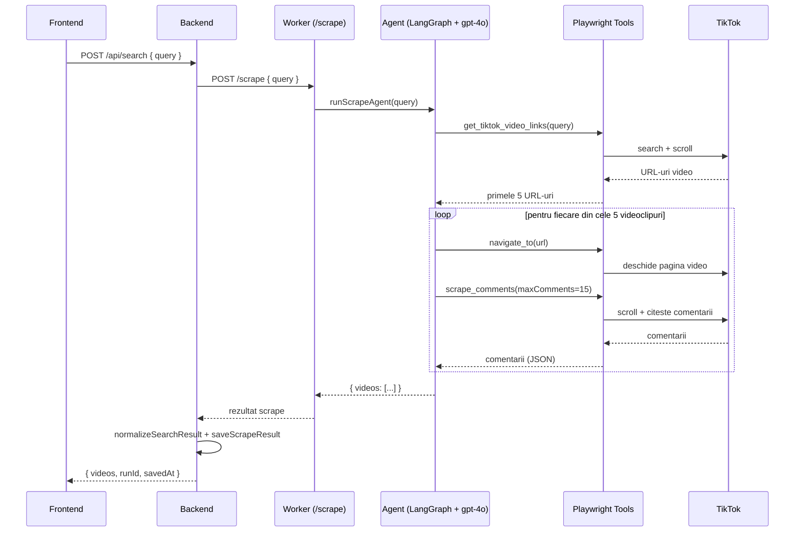

# Workflow — Agentul de scraping

Agentul de scraping este construit cu **LangGraph** (`worker/src/agent/graph.ts`)
și folosește modelul **gpt-4o** prin LangChain. Are acces la un set de tool-uri
Playwright (`worker/src/agent/tools.ts`) care controlează un singur tab de browser.

## Graful agentului (LangGraph state machine)

Bucla `agent → tools → agent` se repetă până când LLM-ul nu mai cere tool-uri și
returnează JSON-ul final cu videoclipuri + comentarii.

## Secvența unui scrape

## Tool-urile disponibile agentului

| Tool | Descriere |
|------|-----------|
| `get_tiktok_video_links` | Caută pe TikTok și întoarce URL-uri unice de video |
| `navigate_to` | Navighează browserul la un URL |
| `scrape_comments` | Extrage comentariile de pe pagina curentă |
| `extract_video_url` | Extrage URL-ul direct MP4 al videoclipului |
| `get_page_text` / `get_element_text` | Citește text din pagină |
| `extract_links` | Extrage linkuri dintr-un selector CSS |
| `scroll_page` / `wait_for_element` / `click_element` | Acțiuni de navigare |

> **Constrângere cheie:** toate tool-urile partajează **un singur tab**, deci
> agentul nu apelează niciodată `navigate_to` în paralel — întâi navighează,
> apoi citește comentariile, apoi trece la următorul video.
